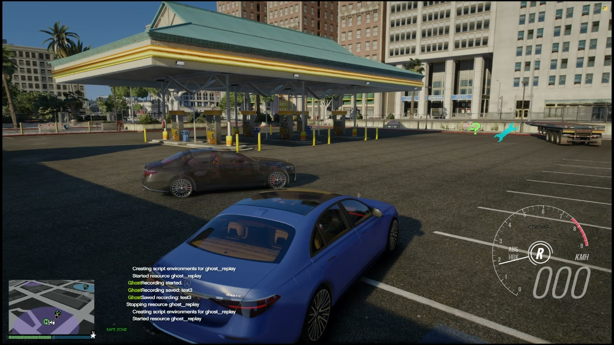

# fivem-ghost-replay
A simple example resource for saving and replaying vehicle "ghosts"

## Installation
1. Download or clone this repository into your FiveM resources folder.
2. Add `start fivem-ghost-replay` to your server.cfg file.
3. Restart your FiveM server.
## Usage
1. Enter a vehicle in-game.
2. Use the command `/ghostrecord start` to start recording your vehicle's movements.
3. Use the command `/ghostrecord stop` to stop recording. (You can provide a name for the recording: `/ghostrecord stop myGhost`)
4. Use the command `/ghostplay myGhost` to replay the recorded ghost.
5. There is no stop playback command as this is just supposed to be an example resource. You can modify the code to add that functionality if needed.

## Notes
- This resource is intended as a simple example and may require further development for production use.
- Recorded ghost data is stored in a folder called recordings. Make sure your server has write permissions to this folder.
- The recording frequency and data stored can be adjusted in the code as needed.
- More data can easily be added to the recording such as vehicle health, wheel angles, brake lights, indicators, and even full prop customizations if desired - Feel free to modify and expand upon this resource to suit your needs!
- Playback is all client side, meaning only the player who initiated the playback will see the ghost vehicle as this resouces original intent was for players to be able to race along their own ghosts.

## Example video 
